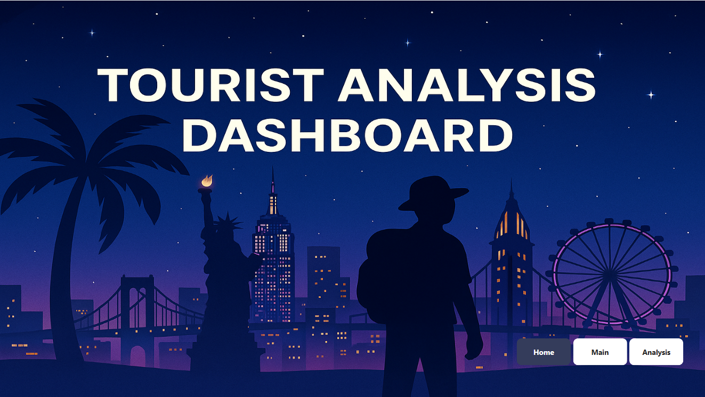

# Tourist Analysis Dashboard

## 📊 Overview

An interactive Power BI dashboard designed to analyze tourist behavior,
travel patterns, spending, destinations, accommodation preferences,
transportation, and feedback.

The dashboard consists of three interactive pages:

- **Home** – Landing page and dashboard navigation
- **Main Dashboard** – Overview of tourist trends, spending, travel costs,
  destinations, and special requirements
- **Analysis Dashboard** – Detailed analysis of tourist demographics,
  accommodation, transportation, destinations, and travel agencies

---

## 🛠️ Tools & Technologies

- Power BI
- DAX
- Power Query
- Data Modeling
- Data Visualization
- Data Analysis

---

## 📈 Dashboard Preview

### 🏠 Home



### 📊 Main Dashboard


### 🔍 Analysis Dashboard


---

## 📌 Key Metrics

| Metric | Value |
|---|---:|
| Total Tourists | 15K |
| Total Revenue | $78.84M |
| Average Trip Cost | $5.26K |
| Average Feedback Score | 3.20 |

---

## 🔍 Key Analysis

### 👥 Tourist Demographics

- Analyzed tourist distribution by gender.
- Examined tourist distribution across different age groups.
- Identified the most represented tourist age groups.

### 🌎 Destinations & Travel Trends

- Analyzed the number of tourists across different months.
- Compared tourist volumes across major destination cities.
- Identified the top destination cities based on tourist activity.
- Analyzed different travel purposes including leisure, business,
  education, medical, and religious travel.

### 💰 Spending & Revenue

- Compared spending across major destination cities.
- Analyzed revenue generated by different travel agencies.
- Compared trip costs across different transportation modes.
- Examined average trip costs across different age groups.

### 🏨 Accommodation & Feedback

- Compared average feedback scores across accommodation types.
- Analyzed tourist preferences across hotels, resorts, hostels,
  Airbnb, and motels.
- Examined the relationship between accommodation type and
  customer feedback.

### ♿ Special Requirements

- Analyzed tourist requirements such as:
  - Diet Food
  - Assistance Required
  - Wheelchair
  - None

---

## 📊 Dashboard Features

- Interactive navigation between dashboard pages
- KPI cards for key business metrics
- Interactive charts and visualizations
- Filters and slicers for dynamic analysis
- DAX-based calculations
- Comparative analysis across multiple dimensions
- Business-focused data storytelling

---

## 💡 Skills Demonstrated

- Data Cleaning & Transformation
- Data Modeling
- DAX Measures
- Power Query
- KPI Development
- Interactive Dashboard Design
- Data Visualization
- Business Intelligence
- Exploratory Data Analysis
- Business Insights & Storytelling

---

## 📁 Project Structure

```text
01-Tourist-Analysis/
│
├── README.md
├── Home.png
├── Main Dashboard.png
└── Analysis Dashboard.png
